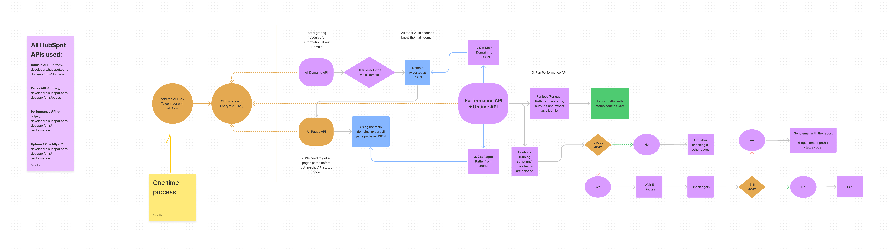

<h1 align="center">HubSpot Performance API Python script 🚦</h1>

<p align="center">This is the manual for the Python script that gets the performance data from a specific HubSpot portal using API key.</p>

<p align="center">
  <a href="./LICENSE">License</a>
</p>




## Getting Started

Make sure to install Python 3.7.3 or higher, and the dependencies listed in the requirements.txt file. Then, run the following command to install the dependencies:

```bash
pip install -r requirements.txt
```

After that, you can run the scripts using your favorite shell with:

```bash
python3 [PATH TO SCRIPT.py]
```

## Setup API Key

Run the "Change API.py" script to setup your API key securely.

```bash
python3 ./Change\ API.py
```
Follow the script instructions and paste your API key into the script to encrypt it.

**IMPORTANT**: Never update or change the API key manually inside the file, this will result in the script breaking for security reasons.

## Consult Available Domains

Use the "Domains.py" script to get a list of available domains in your portal.

```bash
python3 ./Domains.py
```

## HubSpot Performance API

Currently, the script supports only exporting CSV files from Performance and Uptime APIs with errors, paths and numbers information.

Run the "Performance API CLI.py" script to setup your API key securely.

```bash
python3 ./Performance\ API\ CLI.py
```
The script will run constantly and if a 404 is found, then an email will be sent with the report spreadsheet containing all URLs inside the domain, how many 404 were found, period, interval and domain.

Consult the flowchart for further information.


## [Optional] Updating available pages

The pages found inside the main Domain are static, which means if there are new important pages, the "Get All Pages.py" script should be executed to update the list of available pages for the performance API.

```bash
python3 ./Get\ All\ Pages.py
```

### Information about file structure

The files generated by the API scripts are stored in a directory called "Data" in the same directory as the other scripts. The file structure is like this:

```
-- Data
    | - export -> Temporary files exported and mutable like JSON files.
    | - persistent -> Files that are used across all other scripts and APIs.
    | - release -> Final output files, like CSV files.
    | - security -> *This folder is hidden by default, it contains security files like Keys, emails and passwords. Should not be changed.
```

*Does not work in all OSs, just works in Windows, some Linux distros, MacOS and some BSDs.

## 📄 License

Permissions of this strong copyleft license are conditioned on making available complete source code of licensed works and modifications, which include larger works using a licensed work, under the same license. Copyright and license notices must be preserved. Contributors provide an express grant of patent rights.

| Permissions | Restrictions | Conditions
| --- | --- | --- 
&check; Commercial Use | &times; Liability | &#x1f6c8; License and Copyright Notice
&check; Modification   | &times; Warranty | &#x1f6c8; State changes
&check; Distribution |  | &#x1f6c8; Disclose source
&check; Patent Use |  | &#x1f6c8; Same license
&check; Private Use
